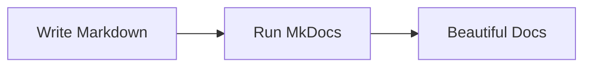

# Getting Started with Material for MkDocs

Material for MkDocs is a powerful theme and plugin ecosystem that transforms MkDocs into a full-featured documentation platform. In this post, I'll share my experience setting up a modern documentation site with built-in blog support.

<!-- more -->

## Why Material for MkDocs?

After evaluating various documentation tools, I chose Material for MkDocs for several compelling reasons:

1. **Beautiful Design Out of the Box** - The Material Design aesthetic provides a clean, modern interface without any customization needed
2. **Rich Feature Set** - Built-in search, dark mode, navigation tabs, and much more
3. **Excellent Performance** - Static sites load instantly and work offline
4. **Markdown Simplicity** - Write in plain Markdown with powerful extensions

## Setting Up Your First Project

Getting started is remarkably straightforward. Here's the minimal setup I used:

### Installation

```bash
pip install mkdocs-material
```

Or if you're using the modern `uv` package manager (which I highly recommend):

```toml
[project]
dependencies = [
    "mkdocs-material==9.6.16",
]
```

### Basic Configuration

Create a `mkdocs.yml` file in your project root:

```yaml
site_name: My Documentation
theme:
  name: material
  features:
    - navigation.instant
    - navigation.tracking
    - navigation.tabs
    
plugins:
  - search
  - blog  # Enable the built-in blog plugin
```

### Project Structure

The beauty of MkDocs is its simple, intuitive structure:

```
project/
├── mkdocs.yml
└── docs/
    ├── index.md
    └── blog/
        ├── index.md
        └── posts/
            └── my-first-post.md
```

## The Built-in Blog Plugin

One of the killer features in Material for MkDocs is the built-in blog plugin. Unlike other static site generators where blogging feels bolted on, here it's a first-class citizen.

### Key Features I Love

- **Automatic Archive Pages** - Posts are automatically organized by date
- **Category Support** - Tag and categorize your content effortlessly  
- **Reading Time** - Automatic calculation of reading time for each post
- **Draft Support** - Keep posts hidden until they're ready
- **Author Profiles** - Built-in support for multiple authors

### Blog Post Metadata

Each blog post starts with YAML frontmatter:

```yaml
---
date: 2025-08-01
categories:
  - Documentation
  - Tutorial
draft: false
---
```

## Advanced Features Worth Exploring

### Code Highlighting

Material for MkDocs includes Pygments for syntax highlighting with support for 200+ languages:

```python
def hello_world():
    """A simple greeting function."""
    print("Hello from Material for MkDocs!")
    return True
```

### Admonitions

!!! tip "Pro Tip"
    Use admonitions to highlight important information. They come in various types like `note`, `warning`, `tip`, and more.

### Mermaid Diagrams

You can even include diagrams using Mermaid syntax:



## My Workflow Tips

After using Material for MkDocs for several projects, here are my recommendations:

1. **Start Simple** - Don't overconfigure initially. The defaults are excellent
2. **Use the Blog Plugin** - Even for documentation sites, a changelog or news section is valuable
3. **Leverage Extensions** - PyMdown Extensions add incredible functionality
4. **Version Control Everything** - Your entire site is text files - perfect for Git

## Performance Considerations

The generated static site is blazingly fast:

- **Zero JavaScript Required** - The site works without JavaScript enabled
- **Instant Loading** - Static HTML means no server processing
- **SEO Friendly** - Clean URLs and proper meta tags out of the box
- **PWA Support** - Can work offline with service workers

## Conclusion

Material for MkDocs strikes the perfect balance between simplicity and power. Whether you're documenting a small project or building a comprehensive knowledge base with integrated blogging, it scales beautifully.

The combination of Markdown simplicity, Material Design aesthetics, and powerful plugins makes it my go-to choice for technical documentation and blogging.

---

*Next time, I'll dive into how I'm using `uv` for lightning-fast Python dependency management. Stay tuned!*