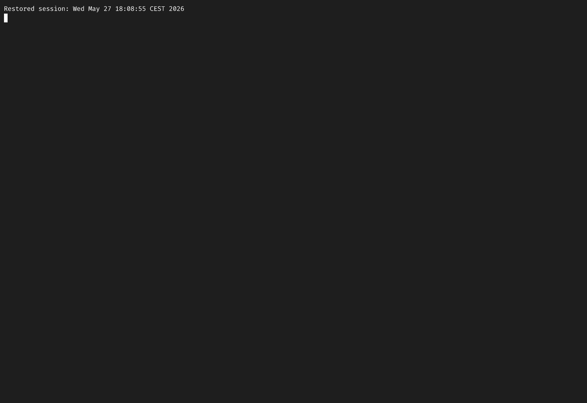

# Agentic editing of terminal screencasts

[asciinema](https://asciinema.org/) is naturally suited to agentic screencast editing. A `.cast` recording is plain text (JSON Lines), one event per line of the form `[interval, code, data]`, where `interval` is seconds since the previous event. Editing reduces to arithmetic on those intervals (and optionally to substitution on the payloads, e.g. for redaction), so a small tool can expose trimming, speeding, and cutting as cheap operations that a language model can reason about and combine.

As a demonstration, I recorded an ~85-minute Claude Code session running an ML fine-tuning task with the [ml-research plugin](https://github.com/krasserm/ml-plugins) and turned it into a 40-second GIF of the highlights without leaving Claude Code. The edit was driven by short natural-language instructions and one custom skill ([`cast-edit`](https://gist.github.com/krasserm/d745bd99013da875258dd495bf967a2d)) that wraps the format with a small [Python tool](https://gist.github.com/krasserm/d745bd99013da875258dd495bf967a2d#file-castedit-py).

<!-- more -->

## The session

The recording started with `asciinema rec` before issuing `/ml-research:ml-research-task` with a prompt to fine-tune `Qwen/Qwen2-0.5B` on `trl-lib/Capybara` via HF Jobs. Claude ran for about 85 minutes, dispatched a researcher subagent, ran a local smoke test, submitted two HF Jobs (a 5-step smoke and a full epoch), and produced a recap table with the final recipe. The raw `.cast` is 5087s, 12,577 events, ~88 KB.

## The edit

The conversation, paraphrased:

1. *"give me an overview, remove the trailing `/quit`, then remove the notable dead-air spans"*. Claude ran `castedit.py analyze` for a few-hundred-token summary of idle gaps and typing runs, located the `/` keypress at t=5083.15s and applied a trailing cut, then applied `idle_cap=2.0` to clamp every gap longer than two seconds. The 5087s recording dropped to 1336s.
2. *"create a 40-second cast that makes user input, intermediate responses, and the final response easy to follow, and speed up everything else. First give me an overview of what is relevant and what to speed up"*. Claude re-analyzed the 1336s cast, identified the readable segments (the typed prompt at t≈12s, the first tool calls at t≈16–50s, an auto-recap at t≈1115s, and the final summary table at t≈1199–1304s), and proposed an eight-region plan with explicit speedup factors per segment:

    | Window (s) | Content | Factor |
    |---|---|---|
    | 0–11.5 | terminal idle before prompt | 10x |
    | 11.5–16.5 | user types the `/ml-research:ml-research-task` prompt | 1x |
    | 16.5–50 | first reply, `Bash(uv --version && hf auth whoami)`, "Preflight passes" | 5x |
    | 50–1115 | subagent work, spinners, polling | 250x |
    | 1115–1120 | first `※ recap` block | 1x |
    | 1120–1199 | waiting for the full HF Jobs run | 50x |
    | 1199–1304 | final "Done" response, stages table, recipe | 7x |
    | 1304–1336 | trailing pings | 30x |

    First render landed at 32s, eight seconds short of target. Claude reallocated the headroom to the two readable stretches with the most text on screen, dropping the early-intermediate factor from 5x to 3.5x and the final-response factor from 7x to 5x. Second render landed at 40.4s.
3. *"render to gif"*. `agg` with `--renderer resvg` and a font fallback that pins `STIX Two Math` for the U+23F5 auto-mode arrows, which agg's default `swash` renderer otherwise displays as tofu.

## The result

The 8.2 MB GIF gives the typed prompt, the first tool calls, the auto-recap, and the final summary table a few seconds of legible screen time each. The 19-minute waiting stretch compresses to under five seconds.

## What made it work

Two design choices in the `cast-edit` skill kept this practical.

**The cast never enters the model's context.** A real recording is megabytes of ANSI output. `castedit.py analyze` parses the file and returns a compact summary: idle gaps over threshold, detected typing runs with reconstructed text snippets, and an estimate of how much idle-capping would reclaim. The model reasons over a few hundred tokens, not the raw stream.

**A small, explicit JSON plan covers the editing surface.** The `edit` command takes three knobs: `idle_cap` clamps every gap to a maximum, `speed_regions` divides intervals in a time range by a factor, and `cuts` drops events in a range. Each knob is a direct manipulation of intervals, so the output stays lossless to rendering and no absolute timestamps need recomputing. The model emits the plan as JSON and the engine applies it.

The accompanying [`SKILL.md`](https://gist.github.com/krasserm/d745bd99013da875258dd495bf967a2d#file-skill-md) is operator notes and guardrails: the rounding behavior that keeps total drift sub-millisecond, why `cuts` cannot shrink pure idle gaps, and the agg flags that avoid Claude Code's known glyph artifacts.

The full editing loop, from "give me an overview" to validated GIF, was a handful of natural-language turns. Most of the guidance is in the skill description telling the model what knobs exist and how to combine them. The model supplies the judgment about which seconds matter to a viewer.
